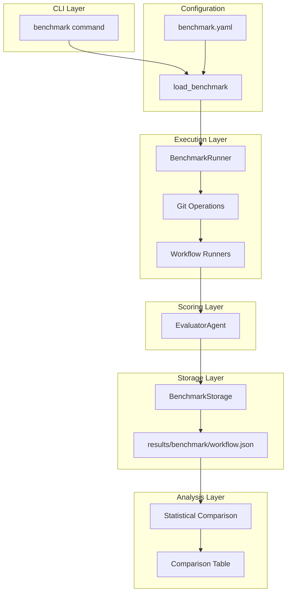
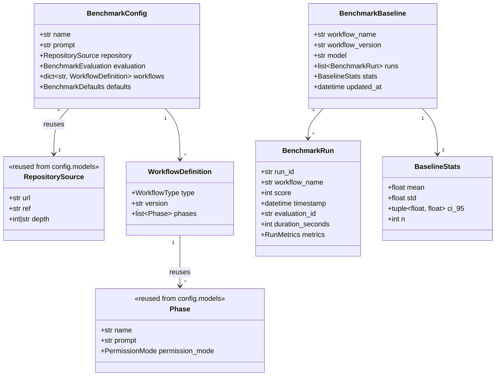
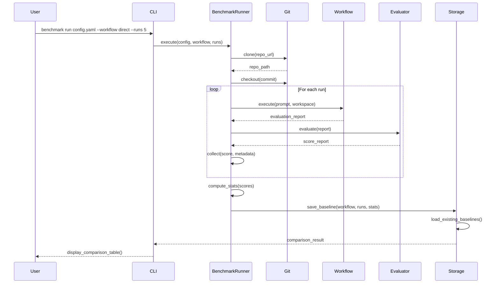

# Benchmark System Implementation Plan

> **Goal**: Enable absolute scoring of workflow approaches with stored baselines for iterative comparison without re-running old configurations.

## Progress

```
Phase 1: Foundation     [██████████] 100% (5/5 tasks) ✓
Phase 2: Execution      [██████████] 100% (4/4 tasks) ✓
Phase 3: Scoring        [░░░░░░░░░░] 0%   (0/2 tasks)
Phase 4: CLI            [░░░░░░░░░░] 0%   (0/5 tasks)
Phase 5: Comparison     [██████████] 100% (3/3 tasks) ✓
─────────────────────────────────────────────────────
Overall                 [██████░░░░] 63%  (12/19 tasks)
```

## Code Quality Standards

All new code must follow these patterns from the existing codebase:

| Pattern | Requirement |
|---------|-------------|
| **Imports** | `from __future__ import annotations` at top |
| **Base class** | Models inherit from `BaseSchema` (not `BaseModel`) |
| **Exports** | Explicit `__all__` in every module |
| **Logging** | `structlog` via `get_logger(__name__)` |
| **Docstrings** | Google style with Args/Returns/Raises |
| **Type hints** | Full annotations, use `X \| None` not `Optional[X]` |
| **Reuse** | Use existing `RepositorySource`, `Phase`, `WorkflowType` |

---

## Architecture Overview

### System Flow



### Component Relationships



### Execution Flow



---

## File Structure

```
src/claude_evaluator/
├── benchmark/                      # NEW - Benchmark system
│   ├── __init__.py
│   ├── runner.py                   # BenchmarkRunner class
│   ├── storage.py                  # Save/load baselines
│   ├── comparison.py               # Statistical comparison
│   └── exceptions.py               # BenchmarkError, StorageError
│
├── models/benchmark/               # NEW - Benchmark models
│   ├── __init__.py
│   ├── config.py                   # BenchmarkConfig, WorkflowDefinition
│   └── results.py                  # BenchmarkRun, BenchmarkBaseline, BaselineStats
│
├── cli/commands/
│   └── benchmark.py                # NEW - BenchmarkCommand
│
├── config/loaders/
│   └── benchmark.py                # NEW: load_benchmark()
│
└── cli/
    ├── parser.py                   # MODIFY: add --benchmark args
    └── main.py                     # MODIFY: add benchmark dispatch

results/                            # NEW - Results directory (gitignored)
└── {benchmark-name}/
    ├── direct.json
    ├── native-plan.json
    └── spectra-v1.0.json

benchmarks/                         # NEW - Benchmark configs (versioned)
└── task-cli.yaml
```

### Current Directory Structure (Post-Refactoring)

```
src/claude_evaluator/
├── agents/                 # Worker and Developer agents
│   ├── developer/
│   └── worker/
├── cli/                    # CLI layer
│   └── commands/
├── config/                 # Configuration
│   └── loaders/            # Suite, experiment, reviewer loaders
├── evaluation/             # Evaluation execution + git ops
│   └── git_operations.py   # Clone, checkout, status
├── experiment/             # Pairwise experiment system
├── metrics/                # Token/cost collection
├── models/                 # Pydantic models by domain
│   ├── evaluation/
│   ├── execution/
│   ├── experiment/
│   └── interaction/
├── report/                 # Report generation
├── sandbox/                # Docker sandbox
├── scoring/                # EvaluatorAgent + reviewers
│   ├── analyzers/
│   ├── ast/
│   ├── checks/
│   └── reviewers/
└── workflows/              # Workflow runners
```

---

## Phase 1: Foundation

> **Goal**: Define data models and configuration loading

### Tasks

- [x] **1.1** Create `models/benchmark/__init__.py`
  - Export all config and results models
  - Add to main `models/__init__.py` exports
- [x] **1.2** Create `models/benchmark/config.py`
  - `BenchmarkConfig` - main config model
  - `BenchmarkCriterion` - scoring criterion
  - `BenchmarkEvaluation` - criteria container
  - `WorkflowDefinition` - workflow type + phases
  - `BenchmarkDefaults` - default settings
  - **Reuse**: `RepositorySource`, `Phase` from `config/models.py`
  - **Reuse**: `WorkflowType` from `models/enums.py`
- [x] **1.3** Create `models/benchmark/results.py`
  - `BenchmarkRun` - single run result
  - `RunMetrics` - tokens, cost, duration
  - `BaselineStats` - mean, std, CI
  - `BenchmarkBaseline` - stored baseline with runs
- [x] **1.4** Create `config/loaders/benchmark.py` with `load_benchmark()`
  - Follow pattern of existing `suite.py` and `experiment.py`
  - Add export to `config/loaders/__init__.py`
- [x] **1.5** Create example benchmark config `benchmarks/task-cli.yaml`

### Models Detail

```python
# models/benchmark/config.py
"""Configuration models for benchmark YAML files."""

from __future__ import annotations

from pydantic import Field, model_validator

from claude_evaluator.config.models import Phase, RepositorySource  # REUSE existing
from claude_evaluator.models.base import BaseSchema
from claude_evaluator.models.enums import WorkflowType  # REUSE existing

__all__ = [
    "BenchmarkConfig",
    "BenchmarkCriterion",
    "BenchmarkDefaults",
    "BenchmarkEvaluation",
    "WorkflowDefinition",
]


class BenchmarkCriterion(BaseSchema):
    """A single evaluation criterion for benchmark scoring.

    Attributes:
        name: Criterion name (e.g., "functionality").
        weight: Weight for scoring (0-1).
        description: What this criterion measures.

    """

    name: str
    weight: float = Field(default=1.0, ge=0.0, le=1.0)
    description: str = ""


class BenchmarkEvaluation(BaseSchema):
    """Evaluation configuration for a benchmark.

    Attributes:
        criteria: List of evaluation criteria.

    """

    criteria: list[BenchmarkCriterion] = Field(default_factory=list)


class WorkflowDefinition(BaseSchema):
    """Definition of a workflow to benchmark.

    Attributes:
        type: Workflow type (direct, plan_then_implement, multi_command).
        version: User-provided version string for tracking.
        phases: Execution phases (for multi_command workflows).

    """

    type: WorkflowType
    version: str = "1.0.0"
    phases: list[Phase] = Field(default_factory=list)  # REUSE existing Phase


class BenchmarkDefaults(BaseSchema):
    """Default settings applied to all benchmark runs.

    Attributes:
        model: Model identifier for worker and judge.
        max_turns: Maximum conversation turns.
        max_budget_usd: Maximum budget in USD.
        timeout_seconds: Maximum execution time.

    """

    model: str = "claude-sonnet-4-20250514"
    max_turns: int = 2000
    max_budget_usd: float = 50.0
    timeout_seconds: int = 36000


class BenchmarkConfig(BaseSchema):
    """Top-level benchmark configuration.

    Attributes:
        name: Benchmark name (used for results directory).
        description: Human-readable description.
        prompt: The task prompt for all workflows.
        repository: Repository to clone (reuses RepositorySource).
        evaluation: Evaluation criteria configuration.
        workflows: Named workflow definitions to compare.
        defaults: Default settings for runs.

    """

    name: str
    description: str = ""
    prompt: str
    repository: RepositorySource  # REUSE existing from config.models
    evaluation: BenchmarkEvaluation = Field(default_factory=BenchmarkEvaluation)
    workflows: dict[str, WorkflowDefinition]
    defaults: BenchmarkDefaults = Field(default_factory=BenchmarkDefaults)

    @model_validator(mode="after")
    def validate_at_least_one_workflow(self) -> BenchmarkConfig:
        """Ensure at least one workflow is defined."""
        if not self.workflows:
            raise ValueError("At least one workflow must be defined")
        return self
```

```python
# models/benchmark/results.py
"""Result models for benchmark runs and baselines."""

from __future__ import annotations

from datetime import datetime

from pydantic import Field

from claude_evaluator.models.base import BaseSchema

__all__ = [
    "BaselineStats",
    "BenchmarkBaseline",
    "BenchmarkRun",
    "RunMetrics",
]


class RunMetrics(BaseSchema):
    """Metrics collected from a single benchmark run.

    Attributes:
        total_tokens: Total tokens consumed.
        total_cost_usd: Total cost in USD.
        turn_count: Number of conversation turns.

    """

    total_tokens: int = 0
    total_cost_usd: float = 0.0
    turn_count: int = 0


class BenchmarkRun(BaseSchema):
    """Result of a single benchmark run.

    Attributes:
        run_id: Unique identifier for this run.
        workflow_name: Name of the workflow executed.
        score: Aggregate score (0-100).
        timestamp: When the run completed.
        evaluation_id: Link to full evaluation report.
        duration_seconds: Total execution time.
        metrics: Token/cost/turn metrics.

    """

    run_id: str
    workflow_name: str
    score: int = Field(..., ge=0, le=100)
    timestamp: datetime
    evaluation_id: str
    duration_seconds: int
    metrics: RunMetrics = Field(default_factory=RunMetrics)


class BaselineStats(BaseSchema):
    """Statistical summary of baseline runs.

    Attributes:
        mean: Mean score across runs.
        std: Standard deviation.
        ci_95: 95% confidence interval (lower, upper).
        n: Number of runs.

    """

    mean: float
    std: float
    ci_95: tuple[float, float]
    n: int


class BenchmarkBaseline(BaseSchema):
    """Stored baseline for a workflow.

    Attributes:
        workflow_name: Name of the workflow.
        workflow_version: User-provided version string.
        model: Model used for runs.
        runs: List of individual run results.
        stats: Computed statistics.
        updated_at: When baseline was last updated.

    """

    workflow_name: str
    workflow_version: str
    model: str
    runs: list[BenchmarkRun]
    stats: BaselineStats
    updated_at: datetime
```

---

## Phase 2: Execution

> **Goal**: Implement benchmark runner with git operations

### Tasks

- [x] **2.1** Create `benchmark/__init__.py`
  - Export `BenchmarkRunner`, exceptions
- [x] **2.2** Create `benchmark/exceptions.py`
  - `BenchmarkError` - base exception (inherits `ClaudeEvaluatorError`)
  - `RepositoryError` - git operations failed
  - `WorkflowExecutionError` - workflow failed
  - `StorageError` - results save/load failed
- [x] **2.3** Create `benchmark/runner.py`
  - `BenchmarkRunner` class
  - `_setup_repository()` - clone using `evaluation/git_operations.clone_repository()`
  - `_create_workflow()` - dispatch to correct workflow class
  - `_execute_single_run()` - run workflow + score
  - `execute()` - main orchestration method
- [x] **2.4** Integrate with existing workflow runners
  - Import and instantiate from `workflows/` module
  - Pass `MetricsCollector` and `EvalDefaults`
  - Handle workflow-specific configuration (phases for multi_command)

### Runner Detail

```python
# benchmark/runner.py
"""Benchmark runner for executing and scoring workflows."""

from __future__ import annotations

import tempfile
from datetime import datetime
from pathlib import Path
from typing import TYPE_CHECKING
from uuid import uuid4

from claude_evaluator.benchmark.exceptions import BenchmarkError, RepositoryError
from claude_evaluator.benchmark.storage import BenchmarkStorage
from claude_evaluator.config.models import RepositorySource
from claude_evaluator.evaluation.git_operations import clone_repository
from claude_evaluator.logging_config import get_logger
from claude_evaluator.models.benchmark.results import (
    BaselineStats,
    BenchmarkBaseline,
    BenchmarkRun,
)

if TYPE_CHECKING:
    from claude_evaluator.models.benchmark.config import BenchmarkConfig, WorkflowDefinition

__all__ = ["BenchmarkRunner"]

logger = get_logger(__name__)


class BenchmarkRunner:
    """Executes benchmark workflows and collects results.

    Orchestrates repository setup, workflow execution, scoring,
    and baseline storage.

    Attributes:
        config: The benchmark configuration.
        results_dir: Directory for storing results.

    """

    def __init__(
        self,
        config: BenchmarkConfig,
        results_dir: Path | None = None,
    ) -> None:
        """Initialize the benchmark runner.

        Args:
            config: Benchmark configuration.
            results_dir: Results directory (default: ./results).

        """
        self.config = config
        self.results_dir = results_dir or Path("results")
        self._storage = BenchmarkStorage(self.results_dir / config.name)

    async def execute(
        self,
        workflow_name: str,
        runs: int = 5,
        version_override: str | None = None,
    ) -> BenchmarkBaseline:
        """Execute a workflow N times and return baseline.

        Args:
            workflow_name: Name of workflow from config.
            runs: Number of runs to execute.
            version_override: Optional version to use instead of workflow.version.

        Returns:
            BenchmarkBaseline with all runs and computed stats.

        Raises:
            BenchmarkError: If workflow not found or execution fails.

        """
        if workflow_name not in self.config.workflows:
            raise BenchmarkError(f"Workflow '{workflow_name}' not found in config")

        workflow = self.config.workflows[workflow_name]
        effective_version = version_override or workflow.version

        logger.info(
            "benchmark_starting",
            benchmark=self.config.name,
            workflow=workflow_name,
            version=effective_version,
            runs=runs,
        )

        run_results: list[BenchmarkRun] = []
        for i in range(runs):
            # Each run gets a fresh clone
            result = await self._execute_single_run(
                workflow=workflow,
                workflow_name=workflow_name,
                run_index=i,
            )
            run_results.append(result)
            logger.info(
                "benchmark_run_complete",
                run=i + 1,
                total=runs,
                score=result.score,
            )

        # Compute stats using bootstrap CI
        stats = self._compute_stats(run_results)

        # Build and save baseline
        # Storage key includes version: e.g., "spectra-v1.1.0"
        storage_key = f"{workflow_name}-v{effective_version}"

        baseline = BenchmarkBaseline(
            workflow_name=storage_key,
            workflow_version=effective_version,
            model=self.config.defaults.model,
            runs=run_results,
            stats=stats,
            updated_at=datetime.now(),
        )

        self._storage.save_baseline(baseline)

        logger.info(
            "benchmark_complete",
            workflow=storage_key,
            version=effective_version,
            mean=stats.mean,
            ci_95=stats.ci_95,
            n=stats.n,
        )

        return baseline

    async def _setup_repository(self) -> Path:
        """Clone repository to temporary directory.

        Returns:
            Path to cloned repository.

        Raises:
            RepositoryError: If clone fails.

        """
        temp_dir = Path(tempfile.mkdtemp(prefix="benchmark_"))
        workspace = temp_dir / "workspace"
        workspace.mkdir()

        try:
            await clone_repository(
                source=self.config.repository,
                target_path=workspace,
            )
        except Exception as e:
            raise RepositoryError(
                f"Failed to clone {self.config.repository.url}: {e}"
            ) from e

        return workspace

    def _compute_stats(self, runs: list[BenchmarkRun]) -> BaselineStats:
        """Compute statistics from run results.

        Args:
            runs: List of benchmark runs.

        Returns:
            BaselineStats with mean, std, CI, and n.

        """
        from claude_evaluator.experiment.statistics import bootstrap_ci
        import statistics as stats_lib

        scores = [r.score for r in runs]
        n = len(scores)

        if n == 0:
            return BaselineStats(mean=0.0, std=0.0, ci_95=(0.0, 0.0), n=0)

        mean = stats_lib.mean(scores)
        std = stats_lib.stdev(scores) if n > 1 else 0.0
        ci_lower, ci_upper = bootstrap_ci(scores, confidence_level=0.95)

        return BaselineStats(
            mean=round(mean, 2),
            std=round(std, 2),
            ci_95=(round(ci_lower, 2), round(ci_upper, 2)),
            n=n,
        )
```

---

## Phase 3: Scoring

> **Goal**: Integrate with EvaluatorAgent for scoring runs

### Tasks

- [ ] **3.1** Add scoring integration to `BenchmarkRunner`
  - Call `EvaluatorAgent.evaluate()` after each run
  - Extract aggregate score from `ScoreReport`
  - Collect metrics (tokens, cost, duration)
- [ ] **3.2** Handle scoring failures gracefully
  - Log errors but continue with remaining runs
  - Mark failed runs appropriately

### Scoring Integration

```python
# In benchmark/runner.py

from claude_evaluator.scoring import EvaluatorAgent  # Updated import path

async def _execute_single_run(
    self,
    workflow: WorkflowDefinition,
    workflow_name: str,
    repo_path: Path,
    run_index: int,
    version_override: str | None = None,
) -> BenchmarkRun:
    """Execute a single run and score it."""
    effective_version = version_override or workflow.version
    run_id = f"{workflow_name}-{run_index}-{uuid4().hex[:8]}"
    start_time = time.time()

    # Execute workflow
    evaluation_report = await self._run_workflow(
        workflow=workflow,
        repo_path=repo_path,
    )

    # Score the result using EvaluatorAgent from scoring module
    evaluator = EvaluatorAgent(
        workspace_path=repo_path,
        enable_ast=True,
    )
    score_report = await evaluator.evaluate(
        evaluation_path=evaluation_report.path,
    )

    duration = int(time.time() - start_time)

    return BenchmarkRun(
        run_id=run_id,
        workflow_name=workflow_name,
        score=score_report.aggregate_score,
        timestamp=datetime.now(),
        evaluation_id=evaluation_report.evaluation_id,
        duration_seconds=duration,
        metrics=RunMetrics(
            total_tokens=evaluation_report.metrics.total_tokens,
            total_cost_usd=evaluation_report.metrics.total_cost_usd,
            turn_count=evaluation_report.metrics.turn_count,
        ),
    )
```

---

## Phase 4: CLI

> **Goal**: Add benchmark commands to CLI

### Tasks

- [ ] **4.1** Update `cli/parser.py`
  - Add `--benchmark` argument
  - Add `--workflow` (reuse existing)
  - Add `--runs` (reuse existing)
  - Add `--version` argument (runtime version override)
  - Add `--compare` flag
  - Add `--list` flag
  - Add `--results-dir` argument
- [ ] **4.2** Create `cli/commands/benchmark.py`
  - `BenchmarkCommand` class
  - `_run()` - execute workflow runs
  - `_compare()` - compare baselines
  - `_list()` - list workflows and status
- [ ] **4.3** Update `cli/main.py`
  - Add benchmark dispatch in `_dispatch()`
- [ ] **4.4** Update `cli/commands/__init__.py`
  - Export `BenchmarkCommand`
- [ ] **4.5** Add output formatting
  - Comparison table format
  - Progress display during runs

### CLI Usage

```bash
# Run a workflow and store baseline
claude-evaluator --benchmark benchmarks/task-cli.yaml \
  --workflow direct \
  --runs 5

# Run with custom results directory
claude-evaluator --benchmark benchmarks/task-cli.yaml \
  --workflow spectra \
  --runs 5 \
  --results-dir ./my-results

# Run with runtime version label (for iterating on Spectra releases)
# Results stored as spectra-v1.1.0 without duplicating workflow definition
claude-evaluator --benchmark benchmarks/task-cli.yaml \
  --workflow spectra \
  --version 1.1.0 \
  --runs 5

# Compare all stored baselines
claude-evaluator --benchmark benchmarks/task-cli.yaml --compare

# List workflows and their baseline status
claude-evaluator --benchmark benchmarks/task-cli.yaml --list

# Output:
# Workflows in task-cli:
#   direct           [5 runs] mean=67.5  95% CI=[62.1, 72.9]
#   native-plan      [5 runs] mean=72.3  95% CI=[68.0, 76.6]
#   spectra-v1.0.0   [5 runs] mean=78.2  95% CI=[74.5, 81.9]
#   spectra-v1.1.0   [5 runs] mean=81.5  95% CI=[78.2, 84.8]
```

### Runtime Version Override

When `--version` is provided at runtime:
- Overrides the `version` field in the workflow definition
- Results stored with workflow name + version (e.g., `spectra-v1.1.0.json`)
- Enables iterating on Spectra without duplicating workflow definitions

```yaml
# Single workflow definition
workflows:
  spectra:
    type: multi_command
    version: "1.0.0"  # Default, can be overridden via --version
    phases: [...]
```

```bash
# Release v1.0.0
claude-evaluator --benchmark task-cli.yaml --workflow spectra --runs 5

# Make changes to Spectra, test v1.1.0
claude-evaluator --benchmark task-cli.yaml --workflow spectra --version 1.1.0 --runs 5

# Compare both versions
claude-evaluator --benchmark task-cli.yaml --compare
```

---

## Phase 5: Comparison

> **Goal**: Statistical comparison and reporting

### Tasks

- [x] **5.1** Create `benchmark/storage.py`
  - `BenchmarkStorage` class
  - `save_baseline()` - write to JSON (use `model_dump_json()`)
  - `load_baseline()` - read from JSON (use `model_validate()`)
  - `load_all_baselines()` - load all for comparison
  - `baseline_exists()` - check if baseline exists
- [ ] **5.2** Create `benchmark/comparison.py`
  - `compare_baselines()` - compare multiple baselines
  - **Prerequisite**: Make `_bootstrap_ci` public in `experiment/statistics.py`
    - Rename to `bootstrap_ci` (remove underscore)
    - Add to `__all__` exports
  - Compute pairwise differences with t-test or bootstrap comparison
- [ ] **5.3** Add comparison output formatting
  - ASCII table for terminal (similar to experiment output)
  - JSON output option (via `--json` flag)

### Comparison Output

```
┌─────────────────┬───────┬─────────────────┬─────┬────────────────────┐
│ Workflow        │ Mean  │ 95% CI          │ n   │ vs direct          │
├─────────────────┼───────┼─────────────────┼─────┼────────────────────┤
│ direct          │ 67.5  │ [62.1, 72.9]    │ 5   │ baseline           │
│ native-plan     │ 72.3  │ [68.0, 76.6]    │ 5   │ +4.8 (p=0.12)      │
│ spectra-v1.0    │ 78.2  │ [74.5, 81.9]    │ 5   │ +10.7* (p=0.02)    │
│ spectra-v1.1    │ 81.5  │ [78.2, 84.8]    │ 5   │ +14.0** (p<0.01)   │
└─────────────────┴───────┴─────────────────┴─────┴────────────────────┘

* p < 0.05  ** p < 0.01

Best performing: spectra-v1.1 (mean=81.5)
Baseline: direct (mean=67.5)
```

### Storage Format

```json
// results/task-cli/spectra-v1.0.json
{
  "workflow_name": "spectra-v1.0",
  "workflow_version": "1.0.0",
  "model": "claude-sonnet-4-20250514",
  "runs": [
    {
      "run_id": "spectra-v1.0-0-a1b2c3d4",
      "workflow_name": "spectra-v1.0",
      "score": 78,
      "timestamp": "2024-01-15T10:00:00Z",
      "evaluation_id": "eval-abc123",
      "duration_seconds": 342,
      "metrics": {
        "total_tokens": 150000,
        "total_cost_usd": 0.45,
        "turn_count": 25
      }
    }
  ],
  "stats": {
    "mean": 78.2,
    "std": 3.1,
    "ci_95": [74.5, 81.9],
    "n": 5
  },
  "updated_at": "2024-01-15T10:30:00Z"
}
```

---

## Example Benchmark Config

```yaml
# benchmarks/task-cli.yaml
name: task-cli
description: Build a task management CLI application

prompt: |
  Build a task management CLI application with the following capabilities:
  1. Add, list, update, and delete tasks
  2. Mark tasks as complete/incomplete
  3. Assign priorities (low, medium, high)
  4. Filter and search tasks
  5. Persist tasks to a JSON file
  6. Support for due dates

# Uses existing RepositorySource model from config/models.py
repository:
  url: "https://github.com/github/codespaces-blank"
  ref: "main"        # Note: uses 'ref' not 'commit' (matches RepositorySource)
  depth: 1           # Shallow clone (default)

defaults:
  model: "claude-sonnet-4-20250514"
  max_turns: 2000
  max_budget_usd: 50.0
  timeout_seconds: 36000

evaluation:
  criteria:
    - name: functionality
      weight: 0.4
      description: "All required features work correctly"
    - name: code_quality
      weight: 0.3
      description: "Clean, idiomatic, well-structured code"
    - name: error_handling
      weight: 0.2
      description: "Graceful handling of edge cases"
    - name: documentation
      weight: 0.1
      description: "Clear README and code comments"

workflows:
  direct:
    type: direct

  native-plan:
    type: plan_then_implement

  spectra-v1.0:
    type: multi_command
    version: "1.0.0"
    phases:
      - name: specify
        permission_mode: acceptEdits
        prompt: "/spectra:specify {{prompt}}"
      - name: clarify
        permission_mode: acceptEdits
        prompt: "/spectra:clarify"
      - name: plan
        permission_mode: acceptEdits
        prompt: "/spectra:plan"
      - name: tasks
        permission_mode: acceptEdits
        prompt: "/spectra:tasks"
      - name: implement
        permission_mode: bypassPermissions
        prompt: "/spectra:implement"

  spectra-v1.1:
    type: multi_command
    version: "1.1.0"
    phases:
      - name: specify
        permission_mode: acceptEdits
        prompt: "/spectra:specify {{prompt}}"
      - name: clarify
        permission_mode: acceptEdits
        prompt: "/spectra:clarify"
      - name: plan
        permission_mode: acceptEdits
        prompt: "/spectra:plan"
      - name: tasks
        permission_mode: acceptEdits
        prompt: "/spectra:tasks"
      - name: validate
        permission_mode: acceptEdits
        prompt: "/spectra:validate"
      - name: implement
        permission_mode: bypassPermissions
        prompt: "/spectra:implement"
```

---

## Dependencies

### Reused Components

| Component | Source | Usage |
|-----------|--------|-------|
| `WorkflowType` | `models/enums.py` | Workflow type enum |
| `RepositorySource` | `config/models.py` | Repository URL + ref config |
| `Phase` | `config/models.py` | Multi-command phase config |
| `EvaluatorAgent` | `scoring/agent.py` | Scoring runs |
| `DirectWorkflow` | `workflows/direct.py` | Direct execution |
| `PlanThenImplementWorkflow` | `workflows/plan_then_implement.py` | Plan mode |
| `MultiCommandWorkflow` | `workflows/multi_command.py` | Spectra-style |
| `clone_repository` | `evaluation/git_operations.py` | Clone repos |
| `_bootstrap_ci` | `experiment/statistics.py` | Confidence intervals (make public) |
| `BaseSchema` | `models/base.py` | Base for all Pydantic models |
| `get_logger` | `logging_config.py` | Structlog logger |

### Changes to Existing Code

| File | Change |
|------|--------|
| `experiment/statistics.py` | Export `bootstrap_ci` (rename from `_bootstrap_ci`) in `__all__` |
| `config/loaders/__init__.py` | Add `load_benchmark` to exports |
| `config/loaders/benchmark.py` | NEW: Create `load_benchmark()` function |
| `cli/parser.py` | Add `--benchmark`, `--compare`, `--list`, `--version` arguments |
| `cli/main.py` | Add benchmark dispatch in `_dispatch()` |

### New Dependencies

None - uses only stdlib and existing dependencies.

---

## Testing Strategy

### Unit Tests

- [ ] `tests/unit/benchmark/test_runner.py`
- [ ] `tests/unit/benchmark/test_storage.py`
- [ ] `tests/unit/benchmark/test_comparison.py`
- [ ] `tests/unit/models/benchmark/test_config.py`
- [ ] `tests/unit/models/benchmark/test_results.py`

### Integration Tests

- [ ] `tests/integration/benchmark/test_benchmark_flow.py`
  - Mock workflow execution
  - Test full run → score → store → compare flow

### E2E Tests

- [ ] `tests/e2e/test_benchmark_cli.py`
  - Test CLI commands with real (small) benchmark

---

## Risk & Mitigations

| Risk | Impact | Mitigation |
|------|--------|------------|
| High variance in scores | Comparisons unreliable | Require minimum N runs, show CI prominently |
| Git clone failures | Run fails | Retry with backoff, cache cloned repos |
| Scoring failures | Incomplete baselines | Continue with other runs, log errors |
| Large result files | Storage bloat | Configurable retention, prune old runs |

---

## Future Enhancements (Out of Scope)

- [ ] Historical trend visualization (charts)
- [ ] CI/CD integration (GitHub Actions)
- [ ] Parallel run execution
- [ ] Cost tracking and budgets
- [ ] Webhook notifications
- [ ] Web dashboard for results
