# Claude Code Evaluator - Architecture & Code Flow

This document provides a comprehensive overview of the codebase architecture, code flow, and patterns used throughout the project.

## Table of Contents

1. [System Overview Diagram](#system-overview-diagram)
2. [Directory Structure](#directory-structure)
3. [Execution Flow](#execution-flow)
4. [Core Components](#core-components)
5. [Configuration System](#configuration-system)
6. [Import Patterns](#import-patterns)
7. [Key Design Patterns](#key-design-patterns)
8. [Code Quality Standards](#code-quality-standards)

---

## System Overview Diagram

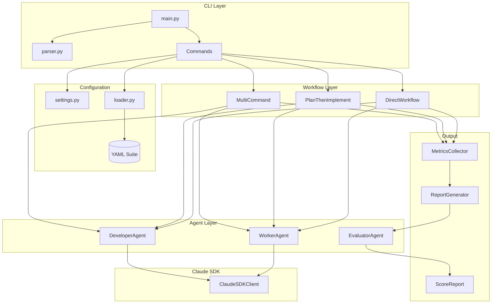

---

## Execution Pipeline Diagram

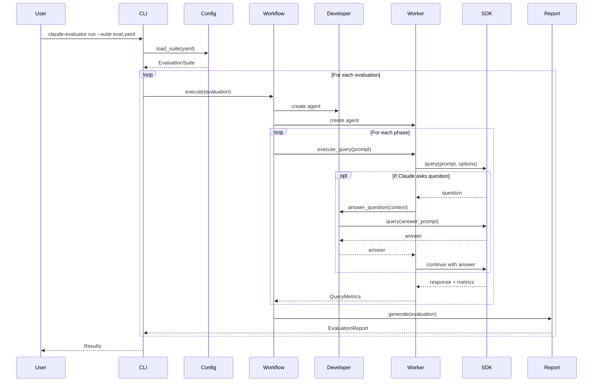

---

## Agent Interaction Diagram

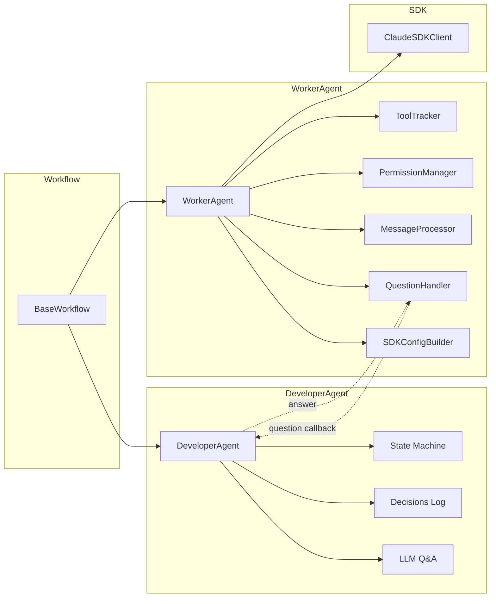

---

## State Machine Diagrams

### Evaluation State Machine

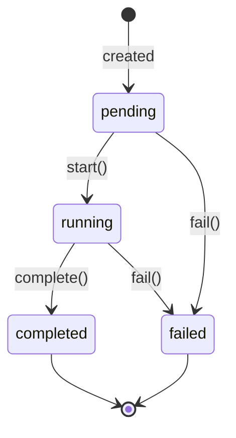

### Developer Agent State Machine

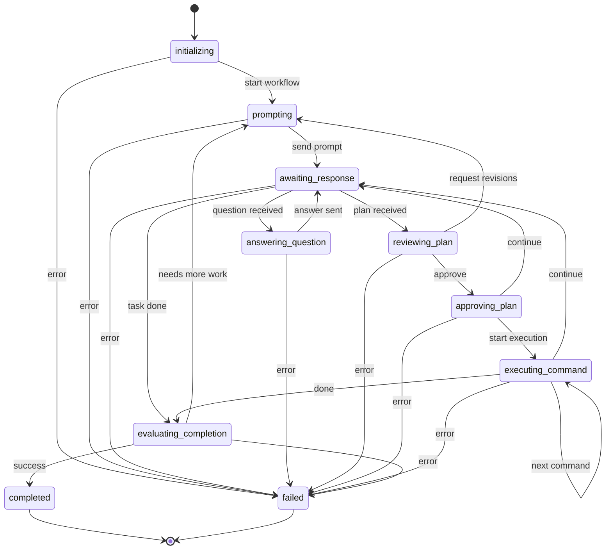

---

## Configuration Flow Diagram

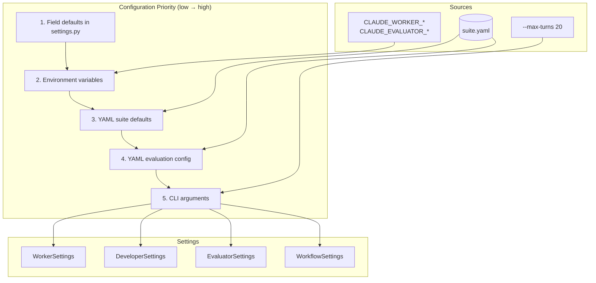

---

## Metrics Collection Diagram

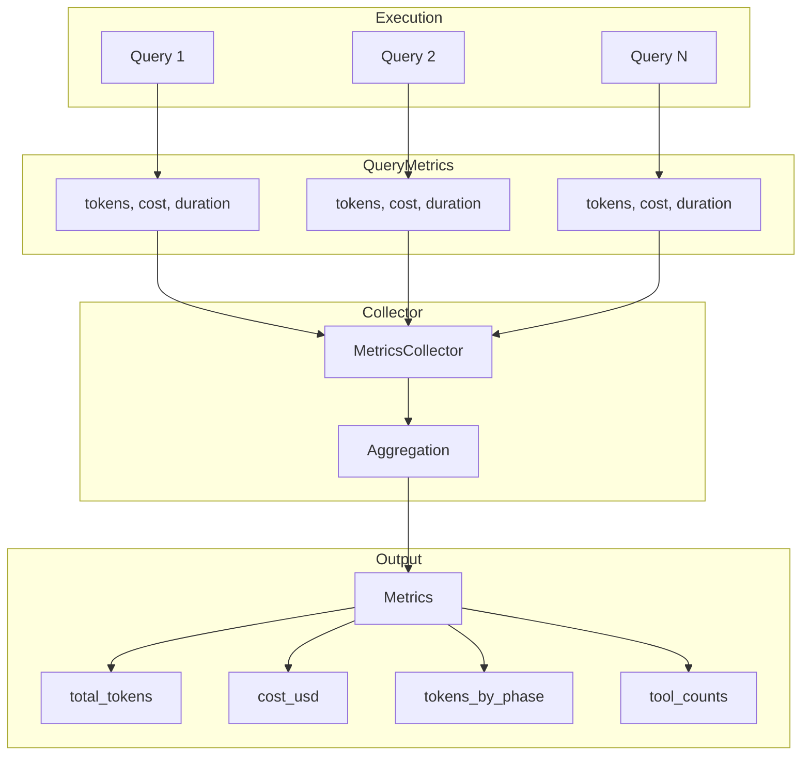

---

## Evaluator Scoring Pipeline

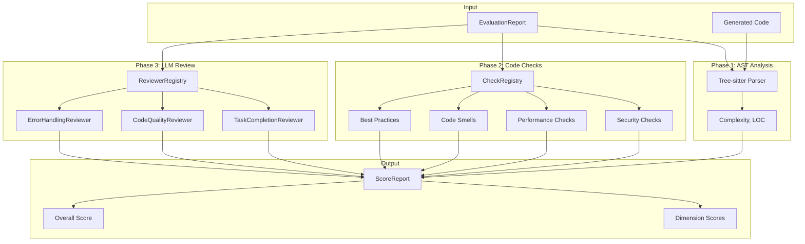

---

## Question Handling Flow

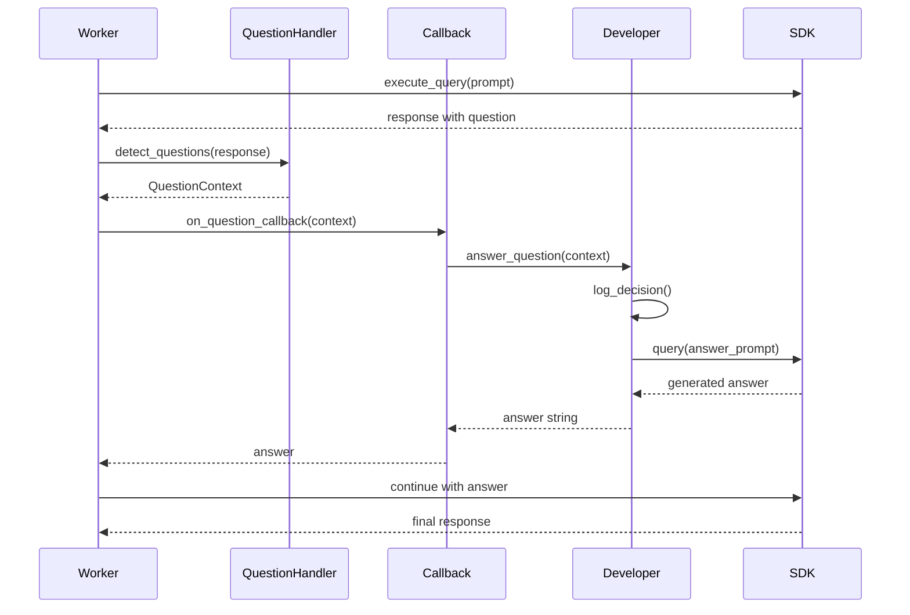

---

## Workflow Types Comparison

```mermaid
graph TB
    subgraph Direct["DirectWorkflow"]
        D1[Task Prompt]
        D2[acceptEdits mode]
        D3[Execute]
        D4[Complete]
        D1 --> D2 --> D3 --> D4
    end

    subgraph PlanThenImplement["PlanThenImplementWorkflow"]
        P1[Task Prompt]
        P2[plan mode - readonly]
        P3[Review Plan]
        P4[acceptEdits mode]
        P5[Implement]
        P6[Complete]
        P1 --> P2 --> P3 --> P4 --> P5 --> P6
    end

    subgraph MultiCommand["MultiCommandWorkflow"]
        M1[Phase 1]
        M2[Phase 2]
        M3[Phase N]
        M4[Complete]
        M1 --> M2 --> M3 --> M4
    end
```

---

## Directory Structure

```
src/claude_evaluator/
├── cli/                          # CLI Interface Layer
│   ├── main.py                   # Entry point - dispatches to commands
│   ├── parser.py                 # Argument parser configuration
│   ├── validators.py             # CLI argument validation
│   ├── formatters.py             # Output formatting utilities
│   └── commands/                 # Command implementations
│       ├── base.py               # BaseCommand abstract class
│       ├── evaluation.py         # Single evaluation execution
│       ├── suite.py              # Multi-evaluation execution
│       ├── score.py              # Evaluation scoring
│       └── validate.py           # Dry-run validation
│
├── config/                       # Configuration Management
│   ├── models.py                 # Pydantic config models
│   ├── loader.py                 # YAML suite loader
│   ├── settings.py               # Environment-based settings
│   ├── validators.py             # Field validators
│   └── exceptions.py             # Config exceptions
│
├── core/                         # Core Execution Engine
│   ├── evaluation.py             # Evaluation state machine
│   ├── git_operations.py         # Git operations
│   ├── formatters.py             # Response formatting
│   ├── state_machine.py          # State machine utilities
│   ├── exceptions.py             # Core exceptions
│   │
│   └── agents/                   # Agent implementations
│       ├── developer.py          # DeveloperAgent - orchestrates workflow
│       ├── worker_agent.py       # WorkerAgent - executes SDK queries
│       ├── exceptions.py         # Agent exceptions
│       │
│       ├── worker/               # WorkerAgent components
│       │   ├── tool_tracker.py
│       │   ├── permission_manager.py
│       │   ├── message_processor.py
│       │   ├── question_handler.py
│       │   └── sdk_config.py
│       │
│       └── evaluator/            # EvaluatorAgent - scoring
│           ├── agent.py
│           ├── claude_client.py
│           ├── prompts.py
│           ├── analyzers/
│           ├── ast/
│           ├── checks/
│           └── reviewers/
│
├── workflows/                    # Workflow Orchestration
│   ├── base.py                   # BaseWorkflow abstract class
│   ├── direct.py                 # Single-phase workflow
│   ├── plan_then_implement.py    # Two-phase workflow
│   ├── multi_command.py          # Multi-phase workflow
│   └── exceptions.py
│
├── models/                       # Pydantic Data Models
│   ├── base.py                   # BaseSchema
│   ├── enums.py                  # All enums
│   ├── metrics.py                # Metrics models
│   ├── query_metrics.py          # Per-query metrics
│   ├── question.py               # Question handling
│   ├── decision.py               # Decision logging
│   ├── tool_invocation.py        # Tool tracking
│   ├── progress.py               # Progress events
│   ├── answer.py                 # Q&A results
│   ├── timeline_event.py         # Timeline events
│   └── score_report.py           # Scoring results
│
├── metrics/                      # Metrics Collection
│   └── collector.py              # MetricsCollector
│
├── report/                       # Report Generation
│   ├── models.py                 # EvaluationReport
│   └── generator.py              # ReportGenerator
│
├── logging_config.py             # Logging setup (structlog)
└── exceptions.py                 # Top-level exceptions
```

---

## Execution Flow

### High-Level Pipeline

```
CLI Entry (main.py)
       │
       ▼
Command Dispatch (evaluation/suite/score)
       │
       ▼
Configuration Loading (loader.py → EvaluationSuite)
       │
       ▼
Workflow Creation (Direct/PlanThenImplement/MultiCommand)
       │
       ▼
Agent Execution (DeveloperAgent + WorkerAgent)
       │
       ▼
Metrics Collection (MetricsCollector)
       │
       ▼
Report Generation (ReportGenerator)
       │
       ▼
Optional Scoring (EvaluatorAgent)
```

### Detailed Flow

1. **CLI Entry**: `main()` → parse args → validate → dispatch to command
2. **Command Execution**: Load suite YAML, create Evaluation objects
3. **Workflow Execution**:
   - Create agents (DeveloperAgent, WorkerAgent)
   - For each phase: set permissions, execute query, handle questions
   - Collect QueryMetrics per query
4. **State Transitions**: `Evaluation: pending → running → completed/failed`
5. **Report Generation**: Create EvaluationReport with timeline, metrics, decisions
6. **Scoring** (optional): AST parsing → code checks → multi-phase review

---

## Core Components

### State Container: `Evaluation`

Pure state object with explicit transitions:

```python
# States: pending → running → completed/failed
evaluation = Evaluation(id="eval-001", task_description="...")
evaluation.start()     # pending → running
evaluation.complete()  # running → completed
evaluation.fail(...)   # running → failed
```

### Agents

| Agent | Responsibility |
|-------|---------------|
| `DeveloperAgent` | Orchestrates workflow, LLM-powered Q&A, logs decisions |
| `WorkerAgent` | Executes Claude SDK queries, tracks tools, manages permissions |
| `EvaluatorAgent` | Scores reports using AST + checks + reviewers |

### Workflows

| Workflow | Phases | Use Case |
|----------|--------|----------|
| `DirectWorkflow` | 1 (acceptEdits) | Simple single-step tasks |
| `PlanThenImplementWorkflow` | 2 (plan → implement) | Tasks needing planning |
| `MultiCommandWorkflow` | N (configurable) | Complex multi-step tasks |

---

## Configuration System

### Settings Hierarchy (lowest → highest priority)

```
1. Inline defaults in Field()     ← settings.py
2. Environment variables          ← CLAUDE_WORKER_*, CLAUDE_EVALUATOR_*
3. YAML suite defaults            ← EvaluationSuite.defaults
4. YAML evaluation overrides      ← EvaluationConfig fields
5. CLI arguments                  ← --max-turns, --model, etc.
```

### Settings Classes

```python
# settings.py - All settings with inline defaults
class WorkerSettings(BaseSettings):
    model: str = Field(default="claude-haiku-4-5@20251001")
    max_turns: int = Field(default=10, ge=1)
    question_timeout_seconds: int = Field(default=60, ge=1, le=300)

class DeveloperSettings(BaseSettings):
    qa_model: str = Field(default="claude-haiku-4-5@20251001")
    context_window_size: int = Field(default=10, ge=1, le=100)
    max_iterations: int = Field(default=100, ge=1)

class EvaluatorSettings(BaseSettings):
    model: str = Field(default="opus")
    max_turns: int = Field(default=50, ge=1, le=50)
    temperature: float = Field(default=0.1, ge=0.0, le=1.0)

class WorkflowSettings(BaseSettings):
    timeout_seconds: int = Field(default=300, ge=10, le=3600)
```

### Accessing Settings

```python
from claude_evaluator.config.settings import get_settings

# Always use get_settings() at runtime - single source of truth
settings = get_settings()
timeout = settings.worker.question_timeout_seconds
model = settings.evaluator.model
```

---

## Import Patterns

### Layered Architecture

```
CLI Layer
    ↓ imports from
Commands Layer
    ↓ imports from
Workflows Layer
    ↓ imports from
Agents Layer
    ↓ imports from
Models Layer + Config Layer
```

### Standard Import Order

```python
# 1. Standard library
import asyncio
from pathlib import Path
from typing import Any

# 2. Third-party
from pydantic import Field
import structlog

# 3. Local imports (absolute)
from claude_evaluator.config.settings import get_settings
from claude_evaluator.models.enums import PermissionMode
from claude_evaluator.core.agents.worker_agent import WorkerAgent
```

### No Circular Imports

- Models don't import from agents
- Agents don't import from workflows
- Config doesn't import from core

---

## Key Design Patterns

### 1. Composition over Inheritance

`WorkerAgent` uses composition with internal components:

```python
class WorkerAgent(BaseSchema):
    # Internal components (initialized in validator)
    _tool_tracker: ToolTracker = PrivateAttr()
    _permission_manager: PermissionManager = PrivateAttr()
    _message_processor: MessageProcessor = PrivateAttr()
    _question_handler: QuestionHandler = PrivateAttr()
```

### 2. State Machine Pattern

`Evaluation` and `DeveloperAgent` use explicit state machines:

```python
_VALID_TRANSITIONS: dict[EvaluationStatus, set[EvaluationStatus]] = {
    EvaluationStatus.pending: {EvaluationStatus.running, EvaluationStatus.failed},
    EvaluationStatus.running: {EvaluationStatus.completed, EvaluationStatus.failed},
    EvaluationStatus.completed: set(),
    EvaluationStatus.failed: set(),
}
```

### 3. Command Pattern

CLI commands implement `BaseCommand`:

```python
class BaseCommand(ABC):
    @abstractmethod
    def execute(self, args: Namespace) -> CommandResult:
        pass
```

### 4. Registry Pattern

Checks and reviewers use registries:

```python
CheckRegistry.register("security", SecurityCheck)
ReviewerRegistry.register("task_completion", TaskCompletionReviewer)
```

### 5. Settings via `get_settings()`

All runtime configuration accessed through singleton:

```python
# Good - single source of truth
timeout = get_settings().worker.question_timeout_seconds

# Bad - don't use instance attributes for settings
# self.question_timeout_seconds  # Removed
```

---

## Code Quality Standards

### Typing

- Full type annotations on all functions
- Use `| None` instead of `Optional`
- Use Pydantic models for data structures

### Pydantic Models

- Extend `BaseSchema` for all models
- Use `Field()` with descriptions
- Validation in `model_validator` decorators

### Error Handling

- Domain-specific exceptions per module
- Never catch bare `Exception` without re-raising
- Log errors with structlog before raising

### Docstrings

- Google style docstrings
- Document Args, Returns, Raises

### File Organization

- One class/concern per file
- snake_case file naming
- Group related files in subdirectories

### Logging

- Use structlog throughout
- Include relevant context in log events
- Use appropriate log levels (debug, info, warning, error)

---

## Model Relationships

### Configuration Models

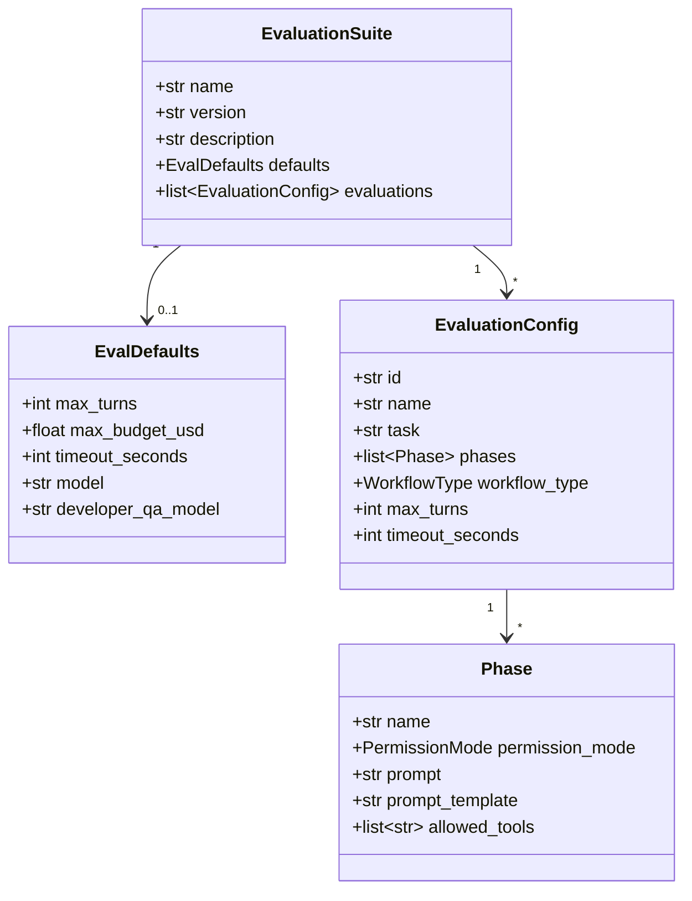

### Runtime Models

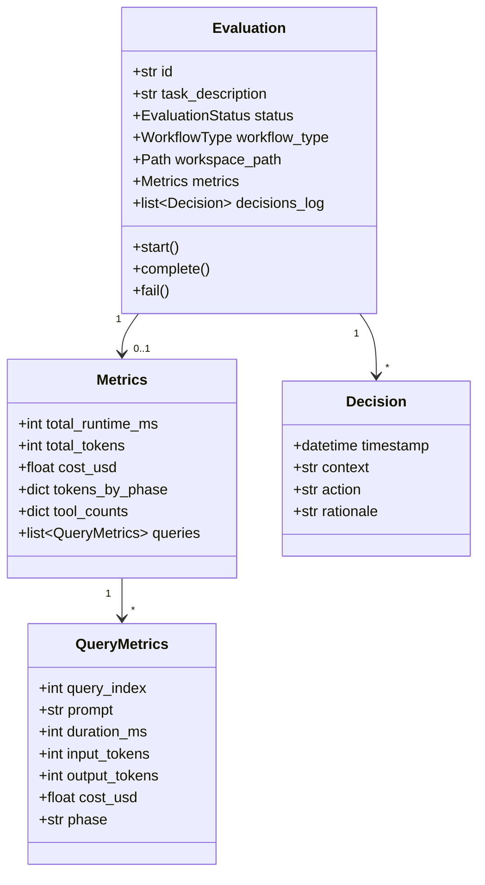

### Output Models

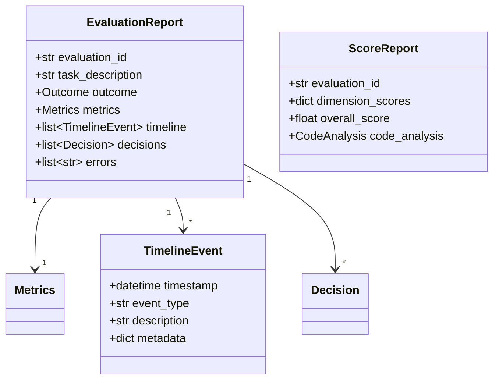

### Enums

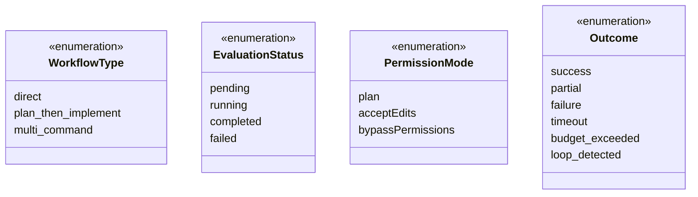

---

## Testing Strategy

### Unit Tests

- Mock external dependencies (SDK, file system)
- Test state transitions explicitly
- Use `get_settings()` mocking for custom values:

```python
from unittest.mock import patch

def test_with_custom_timeout():
    with patch.object(get_settings().worker, 'question_timeout_seconds', 30):
        # Test code that uses the setting
```

### Integration Tests

- Test full workflows with mocked SDK
- Verify metrics collection
- Test brownfield (git clone) scenarios

---

## Key Files to Understand

| File | Purpose |
|------|---------|
| `cli/main.py` | Entry point, command dispatch |
| `config/settings.py` | All runtime settings with defaults |
| `config/loader.py` | YAML parsing and defaults application |
| `workflows/base.py` | Workflow lifecycle and agent management |
| `core/agents/worker_agent.py` | SDK interaction facade |
| `core/agents/developer.py` | Workflow orchestration and Q&A |
| `metrics/collector.py` | Metrics aggregation |
| `report/generator.py` | Report creation |
